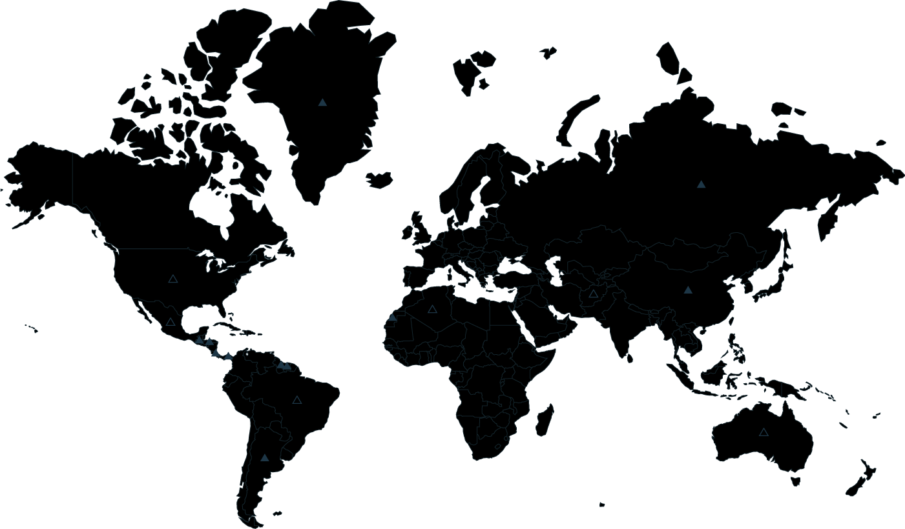

# 🧠 VHU Challenge 2025

**VHU Challenge** is an annual cybersecurity competition organized by **Văn Hiến University (VHU)** — a playground for students passionate about **Information Security**, **CTF (Capture The Flag)**, and **ethical hacking**.  

> 💬 *Hack. Learn. Conquer.*  
> Push your limits. Break systems — not rules.

## 🚩 Overview

VHU Challenge is designed to help students explore real-world vulnerabilities through hands-on web, crypto, forensic, and network challenges.  
Each challenge simulates realistic attack-defense scenarios, allowing participants to **analyze, exploit, and learn**.

### 💡 Key Features
- 🕵️‍♂️ Multiple challenge categories (Web, Crypto, Forensics, OSINT, Misc)
- 💻 Live scoreboard & dynamic ranking system
- 🔐 User registration & team-based participation
- ⚙️ Built using Node.js, Express, MongoDB, and Handlebars (HBS)
- 🎨 Neon-glow cyberpunk UI inspired by hacker aesthetics
- ☁️ Easy deployment via Docker Compose or local environment

## 🧩 Tech Stack

| Layer | Technology |
|-------|-------------|
| **Frontend** | HTML5, Bootstrap 4, Handlebars (HBS), Chart.js |
| **Backend** | Node.js (Express.js) |
| **Database** | MongoDB (Mongoose ORM) |
| **Deployment** | Docker, Nginx Reverse Proxy, Certbot SSL |
| **Styling** | Neon Glow CSS, Google Fonts, Hack Font |
| **Version Control** | Git + GitHub |

## ⚙️ Installation

### 🔸 Clone Repository
```bash
git clone https://github.com/dinhvaren/VHUChallenge.git
cd VHUChallenge
````

### 🔸 Install Dependencies

```bash
npm install
```

### 🔸 Setup Environment

Create a `.env` file in the project root:

```bash
PORT=3000
MONGO_URI=mongodb://localhost:27017/vhuctf
JWT_SECRET=yourSecretKey
SESSION_SECRET=yourSessionKey
```

### 🔸 Run Application

```bash
npm start
```

Access via: [http://localhost:3000](http://localhost:3000)

## 🎮 Gameplay Preview

* **Home Page:** Animated glitch effect with “VHU Challenge” banner
* **Register/Login:** Cyberpunk-style UI with glowing checkboxes & hacker font
* **Hackerboard:** Dynamic chart leaderboard (Chart.js)
* **Challenges:** Realistic exploitation labs with flag submission



## 🧠 Philosophy

> “The quieter you become, the more you are able to hear.”
> — Ancient Hacker Proverb

VHU Challenge is more than a competition — it’s a **learning environment** where students become defenders, attackers, and thinkers in the cyber world.

## 🧑‍💻 Contributors

| Name                                   | Role                     | Contact                                 |
| -------------------------------------- | ------------------------ | --------------------------------------- |
| **Lương Nguyễn Ngọc Đình (d1nhvar3n)** | Founder / Developer      | [GitHub](https://github.com/dinhvaren)  |
| **VHU InfoSec Lab**                    | Support & Infrastructure | [VHU CTF Portal](https://vhu-ctf.io.vn) |

## 📜 License

This project is created for **educational and ethical purposes** only.
All challenge content belongs to **VHU Cybersecurity Lab**.
Unauthorized use in production environments is prohibited.

### 💬 Connect

* 🌐 Portfolio: [https://d1nhvar3n.id.vn](https://d1nhvar3n.id.vn)
* 🧑‍💻 GitHub: [https://github.com/dinhvaren](https://github.com/dinhvaren)
* 📧 Contact: [dinhvaren@vhu.edu.vn](mailto:dinhvaren@vhu.edu.vn)

> ⚡ *“Train like you fight — hack like you learn.”*

